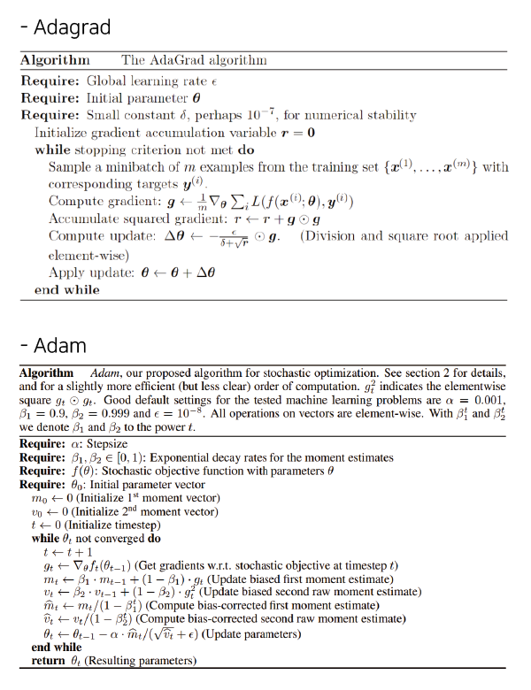
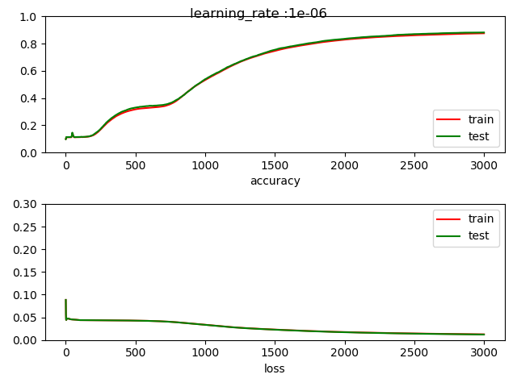
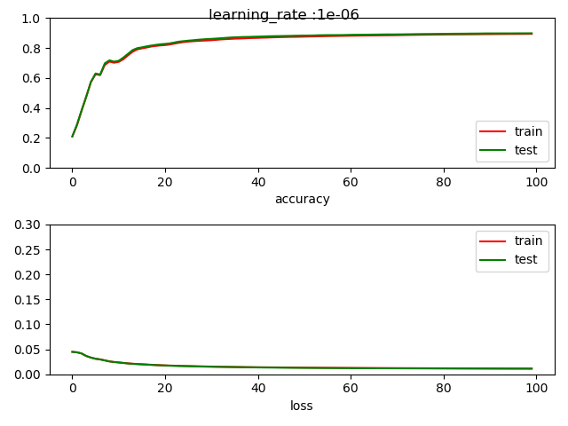

<h1>Assignment-mid-term</h1>  

_+ updated(19.10.27) : Update test results and figures._  
_+ updated(19.10.26) : Add bias and MSE loss function to NetworkModel._  
_+ updated(19.10.24) : printed loss is changed form `MSE` to `Crossentropy` loss and momentum updated. and printed loss can be changed to MSE._
   

Build a neural network using python **without any machine-learning platform.**
  
_This project can be divided to 4 parts_
  
---  

1. Build Neural network without `tensor-flow`.  
(In my case, just used `scikit-learn` for load data.)

2. Test the Network by **changing the activation function**.  
(In this project, `sigmoid`, `Relu` are included.)

3. Test the Network by **changing the optimizer**.  
(This project contains `Gradient-Descent`, `AdaGrad` and `Adam`-optimizer.)

4. Test the Network by **changing the batch size**.  
(I tested batch, mini-batch and stochastic batch size.) 

  
---

<h3>Structure of project</h3>

~~~
-assignment-mid-term : This project is my assignment.
  ├─ -nn : packge of my own network.
  │   │
  │   ├─ -datas.py : Data-Manager for this model. Load data, divide data, etc..
  │   │
  │   ├─ -model.py : Main network models include activate functions, feed-forword, bac
  │   │
  │   └─ -tools.py : Plotting tools.
  │
  ├ -test : Test folder.
  │   │
  │   ├─ -question_2layer_sc.py : Using the 2layer train test.
  │   │
  │   ├─ -tensorflow_test.py : Check the scratch network by using the tensorflow.s
  │   │
  │   └─ -ema_test.py : Before constructing the Adam optimizer, I need to understand how calculat the Expotential moving average.
  │                     This is the test of caculating the ema. 
  │
  └─ -assignment.py : Main SCRIPT of this project.
~~~
 
---
 
<h3>structure of model.py</h3>
In the `model.py` scripts, many functions for training are located. 
 
---
1. Initialize model  
2. Sigmoid activation model  
3. ReLU activation model  
4. Feedforward & backpropagation calculate  
5. Update calculate (gradient-descent, Adagrad, Adam)  
---

 - Initialize model 
 First, setting network by the user configuration.  
 If use the `Adagrad` or `Adam` optimizer, initialize additional params.
 ~~~
def __init__(self, configure, h1=100, h2=50, init_weight=10):
    # weight initialize
    self.w1 = np.random.randn(784, h1) / init_weight
    self.w2 = np.random.randn(h1, h2) / init_weight
    self.w3 = np.random.randn(h2, 10) / init_weight

    self.b1 = np.random.randn(1, h1) / init_weight
    self.b2 = np.random.randn(1, h2) / init_weight
    self.b3 = np.random.randn(1, 10) / init_weight

    # set configure.
    self.configure = configure

    # config data.
    self.TOTAL_EPOCH = configure['total_epoch']
    self.BATCH_SIZE = configure['batch_size']
    self.LEARNING_RATE = configure['learning_rate']
    self.SEED = configure['random_seed']
    self.OPTIMIZER = configure['optimizer']
    self.ACTIVATION = configure['activation']
    self.LOSS = configure['loss']

    if self.OPTIMIZER == OPTIMIZER_GD_MOMENTUM:
        # momenum
        self.MOMENTUM = configure['momentum']
        self.prev_dW1 = np.zeros(self.w1.shape)
        self.prev_dW2 = np.zeros(self.w2.shape)
        self.prev_dW3 = np.zeros(self.w3.shape)
        self.prev_db1 = np.zeros(self.b1.shape)
        self.prev_db2 = np.zeros(self.b2.shape)
        self.prev_db3 = np.zeros(self.b3.shape)

    if self.OPTIMIZER == OPTIMIZER_ADAGRAD:
        self.eps = configure['epsilon']
        self.gt_w1 = np.zeros(self.w1.shape)
        self.gt_w2 = np.zeros(self.w2.shape)
        self.gt_w3 = np.zeros(self.w3.shape)
        self.gt_b1 = np.zeros(self.b1.shape)
        self.gt_b2 = np.zeros(self.b2.shape)
        self.gt_b3 = np.zeros(self.b3.shape)

    if self.OPTIMIZER == OPTIMIZER_ADAM:
        self.beta1 = configure['beta1']
        self.beta2 = configure['beta2']
        self.eps = configure['epsilon']

        # for calculate beta.
        self.counts = 1

        self.mt_w1 = np.zeros(self.w1.shape)
        self.vt_w1 = np.zeros(self.w1.shape)
        self.mt_b1 = np.zeros(self.b1.shape)
        self.vt_b1 = np.zeros(self.b1.shape)

        self.mt_w2 = np.zeros(self.w2.shape)
        self.vt_w2 = np.zeros(self.w2.shape)
        self.mt_b2 = np.zeros(self.b2.shape)
        self.vt_b2 = np.zeros(self.b2.shape)

        self.mt_w3 = np.zeros(self.w3.shape)
        self.vt_w3 = np.zeros(self.w3.shape)
        self.mt_b3 = np.zeros(self.b3.shape)
        self.vt_b3 = np.zeros(self.b3.shape)
 ~~~  
 
 
 - Sigmoid activation model  
 This is for calculate `sigmoid` feedfoward and derivative of sigmoid.
 ~~~
def sigmoid(self, x):
    return 1.0 / (1.0 + np.exp(-x))

def back_sigmoid(self, x):
    return x * (1. - x)
 ~~~  
 
  - ReLU activation model  
 This is for calculate `relu` feedfoward and derivative of sigmoid.
 ~~~
# included back propagation.
def relu(self, x):
    back_relu = np.zeros(x.shape)
    back_relu[np.where(x > 0)] = 1
    x[np.where(x <= 0)] = 0
    
    return x, back_relu
 ~~~
 
   - Feedforward & backpropagation calculate  
 Every one iteration do one feedforward and one backpropagation.  
 After that **update the weights**.   
 Activate function affect to caculate the feedforward and backpropagation, so divide the source by the activate type.
 ~~~
def feedForward(self, x):

    if self.LOSS == LOSS_CROSSENTROPY:
        y1 = np.dot(x, self.w1) + self.b1
        if self.ACTIVATION == ACTIVATE_SIGMOID:
            activated_y1 = self.sigmoid(y1)

            y2 = np.dot(activated_y1, self.w2) + self.b2
            activated_y2 = self.sigmoid(y2)

            y3 = np.dot(activated_y2, self.w3) + self.b3
            result = self.softmax(y3)

            return activated_y1, activated_y2, result

        elif self.ACTIVATION == ACTIVATE_RELU:
            activated_y1 = self.relu(y1)
            y2 = np.dot(activated_y1, self.w2) + self.b2
            activated_y2 = self.relu(y2)
            y3 = np.dot(activated_y2, self.w3) + self.b3
            result = self.softmax(y3)

            return activated_y1, activated_y2, result

    elif self.LOSS == LOSS_MSE:
        y1 = np.dot(x, self.w1) + self.b1
        if self.ACTIVATION == ACTIVATE_SIGMOID:
            activated_y1 = self.sigmoid(y1)

            y2 = np.dot(activated_y1, self.w2) + self.b2
            activated_y2 = self.sigmoid(y2)

            y3 = np.dot(activated_y2, self.w3) + self.b3
            activated_y3 = self.sigmoid(y3)
            result = activated_y3

            return activated_y1, activated_y2, result

        elif self.ACTIVATION == ACTIVATE_RELU:
            activated_y1 = self.relu(y1)
            y2 = np.dot(activated_y1, self.w2) + self.b2
            activated_y2 = self.relu(y2)
            y3 = np.dot(activated_y2, self.w3) + self.b3
            activated_y3 = self.relu(y3)
            result = activated_y3

            return activated_y1, activated_y2, result

def backpropagation(self, x, labelY, out1, out2, out3):

    if self.LOSS == LOSS_CROSSENTROPY:
        d_e = (out3 - labelY)
        # calculate d_w3
        d_w3 = out2.T.dot(d_e)
        d_b3 = np.ones(shape=[1, self.BATCH_SIZE]).dot(d_e)

        if self.ACTIVATION == ACTIVATE_SIGMOID:
            # calculate d_w2
            d_w2 = out1.T.dot(np.matmul(d_e, self.w3.T) * self.back_sigmoid(out2))
            d_b2 = np.ones(shape=[1, self.BATCH_SIZE]).dot(np.matmul(d_e, self.w3.T) * self.back_sigmoid(out2))
            # calculate d_w1
            d_w1 = x.T.dot(
                np.matmul(np.matmul(d_e, self.w3.T) * self.back_sigmoid(out2), self.w2.T) * self.back_sigmoid(out1))
            d_b1 = np.ones(shape=[1, self.BATCH_SIZE]).dot(
                np.matmul(np.matmul(d_e, self.w3.T) * self.back_sigmoid(out2), self.w2.T) * self.back_sigmoid(
                    out1))
            return d_w1, d_w2, d_w3, d_b1, d_b2, d_b3

        elif self.ACTIVATION == ACTIVATE_RELU:
            d_w2 = out1.T.dot(np.matmul(d_e, self.w3.T) * self.back_relu(out2))
            d_b2 = np.ones(shape=[1, self.BATCH_SIZE]).dot(
                np.matmul(d_e, self.w3.T) * self.back_relu(out2))
            d_w1 = x.T.dot(np.matmul(np.matmul(d_e, self.w3.T) * self.back_relu(out2),
                                     self.w2.T) * self.back_relu(out1))
            d_b1 = np.ones(shape=[1, self.BATCH_SIZE]).dot(
                np.matmul(np.matmul(d_e, self.w3.T) * self.back_relu(out2),
                          self.w2.T) * self.back_relu(out1))
            return d_w1, d_w2, d_w3, d_b1, d_b2, d_b3

    elif self.LOSS == LOSS_MSE:
        e = (out3 - labelY)
        if self.ACTIVATION == ACTIVATE_SIGMOID:
            # calculate d_w3
            d_w3 = out2.T.dot(e * self.back_sigmoid(out3))
            d_b3 = np.ones(shape=[1, self.BATCH_SIZE]).dot(e * self.back_sigmoid(out3))
            # calculate d_w2
            d_w2 = out1.T.dot(np.dot(e * self.back_sigmoid(out3), self.w3.T) * self.back_sigmoid(out2))
            d_b2 = np.ones(shape=[1, self.BATCH_SIZE]).dot(
                np.dot(e * self.back_sigmoid(out3), self.w3.T) * self.back_sigmoid(out2))
            # calculate d_w1
            d_w1 = x.T.dot(np.dot(np.dot(e * self.back_sigmoid(out3), self.w3.T) * self.back_sigmoid(out2),
                                  self.w2.T) * self.back_sigmoid(out1))
            d_b1 = np.ones(shape=[1, self.BATCH_SIZE]).dot(
                np.dot(np.dot(e * self.back_sigmoid(out3), self.w3.T) * self.back_sigmoid(out2),
                       self.w2.T) * self.back_sigmoid(out1))

            return d_w1, d_w2, d_w3, d_b1, d_b2, d_b3

        elif self.ACTIVATION == ACTIVATE_RELU:
            # calculate d_w3
            d_w3 = out2.T.dot(e * self.back_relu(out3))
            d_b3 = np.ones(shape=[1, self.BATCH_SIZE]).dot(e * self.back_relu(out3))
            # calculate d_w2
            d_w2 = out1.T.dot(
                np.dot(e * self.back_relu(out3), self.w3.T) * self.back_relu(out2))
            d_b2 = np.ones(shape=[1, self.BATCH_SIZE]).dot(
                np.dot(e * self.back_relu(out3), self.w3.T) * self.back_relu(out2))
            # calculate d_w1
            d_w1 = x.T.dot(np.dot(
                np.dot(e * self.back_relu(out3), self.w3.T) * self.back_relu(out2),
                self.w2.T) * self.back_relu(out1))
            d_b1 = np.ones(shape=[1, self.BATCH_SIZE]).dot(
                np.dot(np.dot(e * self.back_relu(out3), self.w3.T) * self.back_relu(
                    out2), self.w2.T) * self.back_relu(out1))

            return d_w1, d_w2, d_w3, d_b1, d_b2, d_b3
 ~~~
 
- Update calculate (gradient-descent, Adagrad, Adam)  
Calculate weights update.

_If the optimizer is Momentum, calculate the additional params momentum._  
_If the optimizer is Adagrad, calculate the additional params gt for all weights._  
_If the optimizer is Adam, calculate the additional params mt, vt for all weights._  

  
  
  
 ~~~
 def update_weight(self, d_w1, d_w2, d_w3, d_b1, d_b2, d_b3):
    if self.OPTIMIZER == OPTIMIZER_GD:
        self.w1 -= self.LEARNING_RATE * d_w1
        self.w2 -= self.LEARNING_RATE * d_w2
        self.w3 -= self.LEARNING_RATE * d_w3
        self.b1 -= self.LEARNING_RATE * d_b1
        self.b2 -= self.LEARNING_RATE * d_b2
        self.b3 -= self.LEARNING_RATE * d_b3

    elif self.OPTIMIZER == OPTIMIZER_GD_MOMENTUM:
        self.prev_dW1 = (self.MOMENTUM * self.prev_dW1) + (self.LEARNING_RATE * d_w1)
        self.prev_dW2 = (self.MOMENTUM * self.prev_dW2) + (self.LEARNING_RATE * d_w2)
        self.prev_dW3 = (self.MOMENTUM * self.prev_dW3) + (self.LEARNING_RATE * d_w3)
        self.prev_db1 = (self.MOMENTUM * self.prev_db1) + (self.LEARNING_RATE * d_b1)
        self.prev_db2 = (self.MOMENTUM * self.prev_db2) + (self.LEARNING_RATE * d_b2)
        self.prev_db3 = (self.MOMENTUM * self.prev_db3) + (self.LEARNING_RATE * d_b3)

        self.w1 -= self.prev_dW1
        self.w2 -= self.prev_dW2
        self.w3 -= self.prev_dW3
        self.b1 -= self.prev_db1
        self.b2 -= self.prev_db2
        self.b3 -= self.prev_db3

    elif self.OPTIMIZER == OPTIMIZER_ADAGRAD:
        # update the gt.
        self.gt_w1 += np.square(d_w1 ** 2)
        self.gt_w2 += np.square(d_w2 ** 2)
        self.gt_w3 += np.square(d_w3 ** 2)
        self.gt_b1 += np.square(d_b1 ** 2)
        self.gt_b2 += np.square(d_b2 ** 2)
        self.gt_b3 += np.square(d_b3 ** 2)

        # change the learning rate for each weight.
        self.w1 -= (self.LEARNING_RATE / np.sqrt(self.gt_w1 + self.eps)) * d_w1
        self.w2 -= (self.LEARNING_RATE / np.sqrt(self.gt_w2 + self.eps)) * d_w2
        self.w3 -= (self.LEARNING_RATE / np.sqrt(self.gt_w3 + self.eps)) * d_w3
        # change the learning rate for each bias.
        self.b1 -= (self.LEARNING_RATE / np.sqrt(self.gt_b1 + self.eps)) * d_b1
        self.b2 -= (self.LEARNING_RATE / np.sqrt(self.gt_b2 + self.eps)) * d_b2
        self.b3 -= (self.LEARNING_RATE / np.sqrt(self.gt_b3 + self.eps)) * d_b3

    elif self.OPTIMIZER == OPTIMIZER_ADAM:

        self.mt_w1 = (self.beta1 * self.mt_w1) + ((1 - self.beta1) * d_w1)
        self.vt_w1 = (self.beta2 * self.vt_w1) + ((1 - self.beta2) * (d_w1 ** 2))
        self.mt_b1 = (self.beta1 * self.mt_b1) + ((1 - self.beta1) * d_b1)
        self.vt_b1 = (self.beta2 * self.vt_b1) + ((1 - self.beta2) * (d_b1 ** 2))

        self.mt_w1 = self.mt_w1 / (1 - self.beta1)
        self.vt_w1 = self.vt_w1 / (1 - self.beta2)
        self.mt_b1 = self.mt_b1 / (1 - self.beta1)
        self.vt_b1 = self.vt_b1 / (1 - self.beta2)

        self.mt_w2 = (self.beta1 * self.mt_w2) + ((1 - self.beta1) * d_w2)
        self.vt_w2 = (self.beta2 * self.vt_w2) + ((1 - self.beta2) * (d_w2 ** 2))
        self.mt_b2 = (self.beta1 * self.mt_b2) + ((1 - self.beta1) * d_b2)
        self.vt_b2 = (self.beta2 * self.vt_b2) + ((1 - self.beta2) * (d_b2 ** 2))

        self.mt_w2 = self.mt_w2 / (1 - self.beta1)
        self.vt_w2 = self.vt_w2 / (1 - self.beta2)
        self.mt_b2 = self.mt_b2 / (1 - self.beta1)
        self.vt_b2 = self.vt_b2 / (1 - self.beta2)

        self.mt_w3 = (self.beta1 * self.mt_w3) + ((1 - self.beta1) * d_w3)
        self.vt_w3 = (self.beta2 * self.vt_w3) + ((1 - self.beta2) * (d_w3 ** 2))
        self.mt_b3 = (self.beta1 * self.mt_b3) + ((1 - self.beta1) * d_b3)
        self.vt_b3 = (self.beta2 * self.vt_b3) + ((1 - self.beta2) * (d_b3 ** 2))

        self.mt_w3 = self.mt_w3 / (1 - self.beta1)
        self.vt_w3 = self.vt_w3 / (1 - self.beta2)
        self.mt_b3 = self.mt_b3 / (1 - self.beta1)
        self.vt_b3 = self.vt_b3 / (1 - self.beta2)

        self.counts += 1
        self.beta1 = 2 / (self.counts + 1)
        self.beta2 = 2 / (self.counts + 1)

        self.w1 -= (self.LEARNING_RATE / np.sqrt(self.vt_w1 + self.eps)) * self.mt_w1
        self.w2 -= (self.LEARNING_RATE / np.sqrt(self.vt_w2 + self.eps)) * self.mt_w2
        self.w3 -= (self.LEARNING_RATE / np.sqrt(self.vt_w3 + self.eps)) * self.mt_w3
        self.b1 -= (self.LEARNING_RATE / np.sqrt(self.vt_b1 + self.eps)) * self.mt_w1
        self.b2 -= (self.LEARNING_RATE / np.sqrt(self.vt_b2 + self.eps)) * self.mt_w2
        self.b3 -= (self.LEARNING_RATE / np.sqrt(self.vt_b3 + self.eps)) * self.mt_w3
~~~

 
---
 
<h3>structure of assignment.py</h3>

First, setting the params for data using config dic data.   
This config has many params and you can change the `epoch`, `learning_rate`, `batch_size`, `activation`, `optimizer`, etc...  
~~~
INFO_SIGMOID_MOMENTUM_MSE_BATCH = {'total_epoch': 3000,
                                   'batch_size': 60000,
                                   'learning_rate': 1e-6,
                                   'random_seed': 42,
                                   'train_dataset_size': 60000,
                                   'test_dataset_size': 10000,
                                   'momentum': 0.8,
                                   'optimizer': nn.model.OPTIMIZER_GD_MOMENTUM,
                                   'activation': nn.model.ACTIVATE_SIGMOID,
                                   'loss': nn.model.LOSS_MSE}
~~~  
 

Next, define network_model and load dataManager.
~~~
# define network nn.
network_model = network(configure=config_assignmentD_ADAM, h1=256, h2=256)
dataManager = data_manager()
~~~
  

 

Training network is simple. just load the batch data, and run **train()** function.  
Train method _update all weights one time_ because understand how can back-porpagation work in network. So just use kind of `for loop` for train the network.
~~~
# load batch data.
batch_x, batch_y = dataManager.next_batch(network_model.BATCH_SIZE)

# train model.
network_model.train(batch_x, batch_y)
~~~
  
  
 

Calculate Accuracy and loss by using network function.  
See below code.

~~~
# calculate accuracy and loss
output_train = network_model.predict(dataManager.X_train)
accuracy_train, loss_train = network_model.getAccuracyAndLoss(output_train, dataManager.y_train)
~~~

 
---
 
<h3>result of model training </h3>

- defined model. (100 h1 layers, 50 h2 layers.)
~~~
# define network nn.
network_model = network(configure=config_assignmentB, h1=256, h2=256)
dataManager = data_manager()
~~~

- network_assignment_A(batch, sigmoid activation, MSE loss, momentum)
~~~
INFO_SIGMOID_MOMENTUM_MSE_BATCH = {'total_epoch': 3000,
                                   'batch_size': 60000,
                                   'learning_rate': 1e-6,
                                   'random_seed': 42,
                                   'train_dataset_size': 60000,
                                   'test_dataset_size': 10000,
                                   'momentum': 0.8,
                                   'optimizer': nn.model.OPTIMIZER_GD_MOMENTUM,
                                   'activation': nn.model.ACTIVATE_SIGMOID,
                                   'loss': nn.model.LOSS_MSE}
                      
                   
#result.   
============== EPOCH 2996 START ==============
============== EPOCH 2996 END ================
train accuracy : 0.8768; loss : 0.0125, test accuracy : 0.883; loss : 0.0121
============== EPOCH 2997 START ==============
============== EPOCH 2997 END ================
train accuracy : 0.8768; loss : 0.0125, test accuracy : 0.883; loss : 0.0121
============== EPOCH 2998 START ==============
============== EPOCH 2998 END ================
train accuracy : 0.8768; loss : 0.0125, test accuracy : 0.883; loss : 0.0121
============== EPOCH 2999 START ==============
============== EPOCH 2999 END ================
train accuracy : 0.8768; loss : 0.0125, test accuracy : 0.883; loss : 0.0121
============== EPOCH 3000 START ==============
============== EPOCH 3000 END ================
train accuracy : 0.8768; loss : 0.0125, test accuracy : 0.883; loss : 0.0121                                    
~~~
  

- network_assignment_B(batch, ReLU activation, MSE loss, momentum)
~~~
INFO_RELU_GD_MSE_BATCH = {'total_epoch': 100,
                          'batch_size': 60000,
                          'learning_rate': 1e-6,
                          'random_seed': 42,
                          'train_dataset_size': 60000,
                          'test_dataset_size': 10000,
                          'momentum': 0.8,
                          'optimizer': nn.model.OPTIMIZER_GD_MOMENTUM,
                          'activation': nn.model.ACTIVATE_RELU,
                          'loss': nn.model.LOSS_MSE}
                      
                   
#result.   
============== EPOCH 97 START ==============
============== EPOCH 97 END ================
train accuracy : 0.8948; loss : 0.0115, test accuracy : 0.899; loss : 0.0112
============== EPOCH 98 START ==============
============== EPOCH 98 END ================
train accuracy : 0.895; loss : 0.0115, test accuracy : 0.899; loss : 0.0111
============== EPOCH 99 START ==============
============== EPOCH 99 END ================
train accuracy : 0.8953; loss : 0.0115, test accuracy : 0.899; loss : 0.0111
============== EPOCH 100 START ==============
============== EPOCH 100 END ================
train accuracy : 0.8956; loss : 0.0115, test accuracy : 0.899; loss : 0.0111                               
~~~
  

